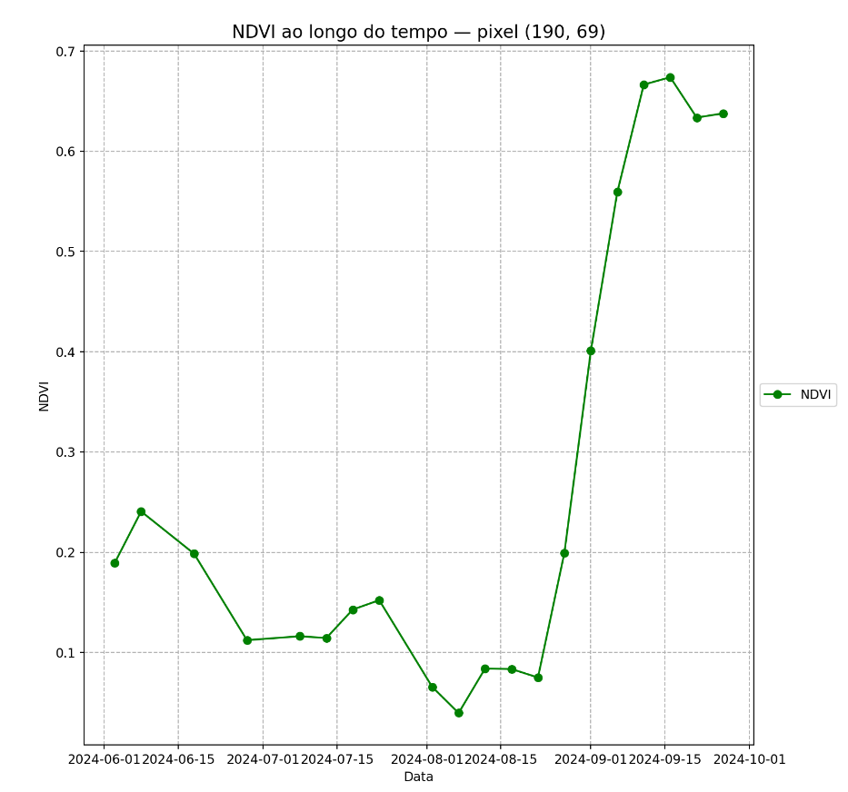

# Pest-Net in Melon Crops

A common practice in the northen region of Brazil is to use a pest-net right after the installation of plastic mulching cover. In this project we're verifying wheater the pest-net used in this region can be detected through a anomaly detection model, given its behavior through time.  

</img>